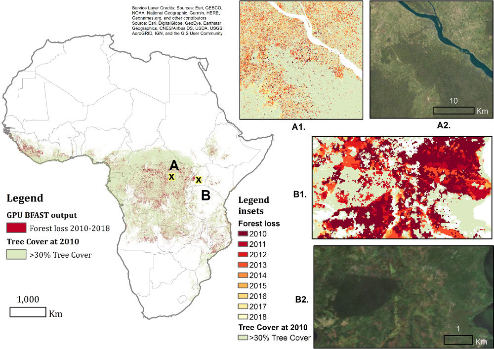

.. BFAST documentation master file, created by
   sphinx-quickstart on Thu Oct 17 13:29:20 2019.
   You can adapt this file completely to your liking, but it should at least
   contain the root `toctree` directive.

Break Detection for Additive Season and Trend
=============================================
Large amounts of satellite data are now becoming available, which, in combination with appropriate change detection methods, offer the opportunity to derive accurate information on timing and location of disturbances such as deforestation events across the earth surface. 

Typical scenarios require the analysis of billions of image patches/pixels, which can become very expensive from a computational point of view. The bfast package provides an efficient massively-parallel implementation for one of the state-of-the-art change detection methods called `Breaks For Additive Season and Trend (BFASTmonitor) <http://bfast.r-forge.r-project.org>`_ proposed by Verbesselt et al. The implementation is based on `OpenCL <https://www.khronos.org/opencl>`_ and allows to process large-scale change detection scenarios given satellite time series data.

    Application of BFAST-Monitor

The image above shows the output of the massively-parallel implementation provided by this package applied to satellite time series data covering the entire continental tropical Africa. It illustrates the detected breaks with a negative magnitude (red). The inset figures zoom in on deforestation areas. A1 and B1 emphasize the timing of the detected breaks. A2 and B2 show the deforestation on RGB satellite imagery. 

The source code is published under the GNU General Public License (GPLv3). The authors are not responsible for any implications that stem from the use of this software.

.. toctree::
   :maxdepth: 2
   :caption: Contents:

Contents
--------
.. toctree::
   :maxdepth: 2

   install
   getting_started
   reference
   license
   release_notes

Indices
--------
* :ref:`genindex`
* :ref:`modindex`

